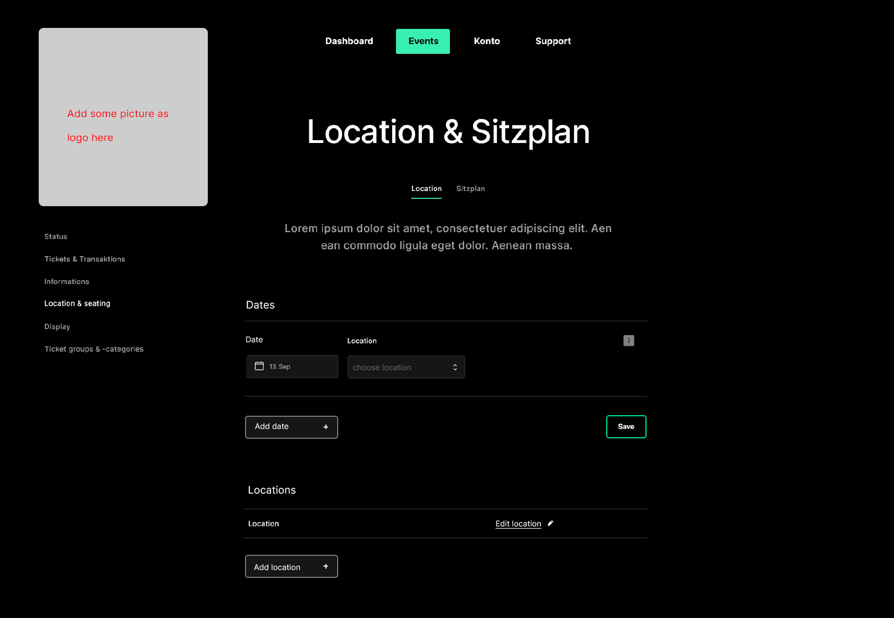
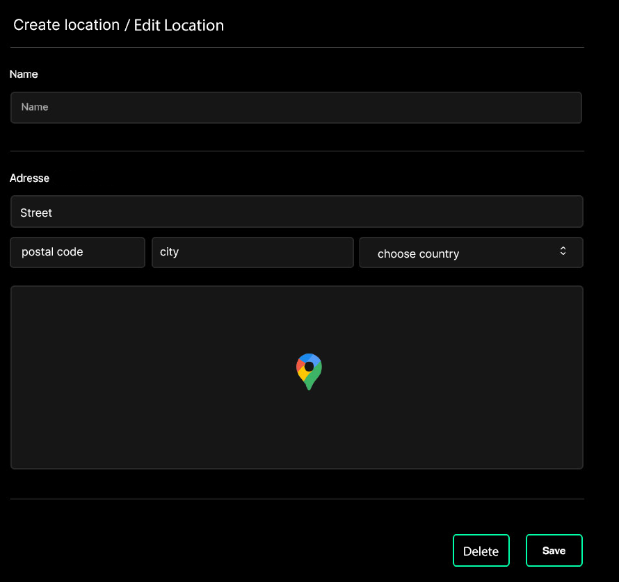

# code-challenge

The project contains a new Next.js Typescript application with MUI installed. Feel free to use MUI components or add more libraries if you need them.

## Tasks
1. Read through the instructions.
2. Take a look at the base project.
3. Add components and assemble them in the pages/index.tsx file to display the one page content described below.

In general: Good code is the priority. We do NOT expect the design of the page to be replicated 1:1.

## Page Content

Recreate the following page:

Create / edit location dialog

## Data
Data should be stored in redux.

## "Dates" Row:

- Each Date-Row has a date input and a location selection.

- The location selection should show list with the names of all locations.

- The "Add date" button should create a new, empty row with date and location inputs.

- The "Save" button stores the data in redux.

## "Locations" Row

- A list of all locations with the location name is shown.

- The "Add location" button should open a dialog with the inputs as show in the second image.

- Locations can be edited through a button in the location list which opens the location dialog with the existing location data.

- When a location is added or edited the location list is updated and the data is stored in redux.

## Location Dialog
The Save Button creates a new location or updates a location when a location is being edited.
The delete button is shown when a location is edited and deletes the corresponding location.

Both buttons close the dialog after their action.

No need to integrate a real maps component despite the location icon in the design.

Design Note:

If you're working on the design, the icons should be in the project and both the side and top menu exist as components and can be reused.